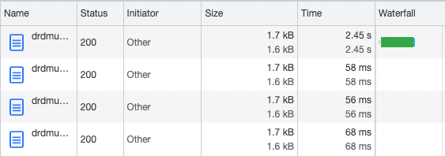
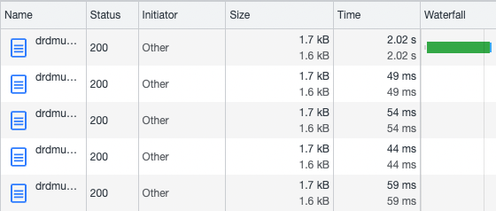
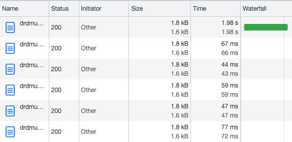
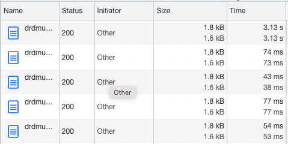
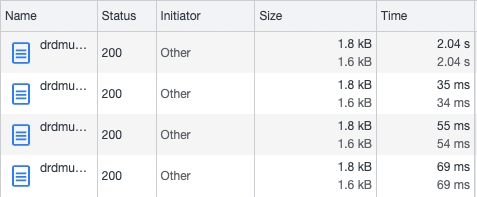
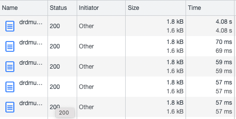
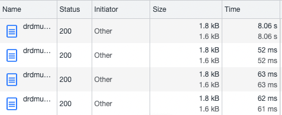

# poc-java-mongo-lambda-optimized
Look at a few recent optimizations for Java lambda to see if they reduce cold-start for lambda to an acceptable latency for APIs.

Initial version (basic deps - Jackson, Log4J, AWS handler interface):  

After adding the environment variable:  
JAVA_TOOL_OPTIONS="-XX:+TieredCompilation -XX:TieredStopAtLevel=1"  

Add the Mongo driver and print the version in the response:

Remove the environment variable:

Add the environment variable back:

Add a Mongo query:

Mongo query without the environment variable - timed out after 6 seconds!!:

Changed the timeout to 15s:

