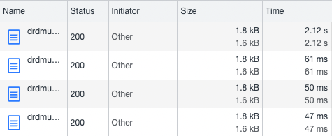
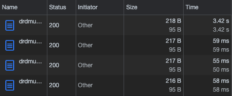
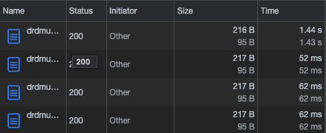
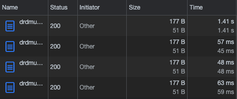
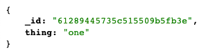
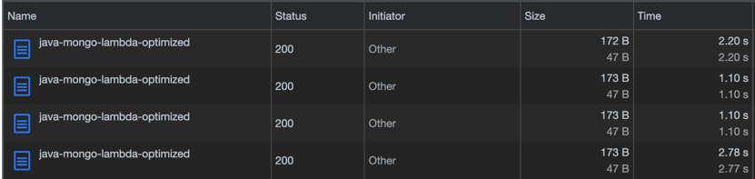

# poc-java-mongo-lambda-optimized
Look at a few recent optimizations for Java lambda to see if they reduce cold-start for lambda to an acceptable latency for APIs.

Initial version (basic deps - Jackson, Log4J, AWS handler interface):  

After adding the environment variable:  
JAVA_TOOL_OPTIONS="-XX:+TieredCompilation -XX:TieredStopAtLevel=1"  

Add the Mongo driver and print the version in the response:  

Remove the environment variable:  

Add the environment variable back:  

Add a Mongo query:  

Mongo query without the environment variable - timed out after 6 seconds!!:  
  
Changed the timeout to 15s:  

Add the environment variable and increase the RAM to 10240MB (10GB!):  

After running YourKit, see that Apache Log4J was adding 2MB to the bundle and 600 classes the classloader was taking 300ms to load them - remove Log4J!:  

After removing Jackson and switching from our own implementations of the Event classes to the AWS library:    

After increasing the memory to 4096 (1.4s):  

Switch to using JSON serializer built into MongoDB to seralize the response (no change in performance - 1.4s):  
    
  

Try using the HTTP data API (no Mongo driver at all!):  
