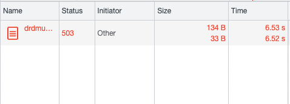
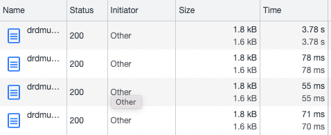

# poc-java-mongo-lambda-optimized
Look at a few recent optimizations for Java lambda to see if they reduce cold-start for lambda to an acceptable latency for APIs.

### Lessons
Lessons to take to bring a Java MongoDB AWS Lambda cold start down to ~1s:  
- Always remove Log4J - it's a massive amount of classes to load (600+)
  - SL4J simple binding and 4096MB RAM
  - Saves ~300ms to make this switch
- If you're using MongoDB driver, you can use the driver's internal JSON serializer to save importing Jackson or similar
- Always use this environment variable:
  - JAVA_TOOL_OPTIONS	-XX:+TieredCompilation -XX:TieredStopAtLevel=1 
  - Ref: https://aws.amazon.com/blogs/compute/optimizing-aws-lambda-function-performance-for-java/
  - In this example, a mongo find query had an 8s cold start without it, and 4s with (before further optimizations).
- Java likes memory. Try 4096MB for a MongoDB connection lambda.
- Don't bother with the Netty streamfactory, it adds too much overhead and is slower
  - The epoll native option doesn't currently (April 22) work with Mongo driver.
- Use ARM architecture if cost is an issue (it is roughly the same for performance, and cheaper). adds 100ms or so.

### Measurements 
##### (round trip from a consistent Internet client in Sydney to AWS Sydney having around 50-60ms latency)  

Initial version (basic deps - Jackson, Log4J, AWS handler interface):  

After adding the environment variable:  
JAVA_TOOL_OPTIONS="-XX:+TieredCompilation -XX:TieredStopAtLevel=1"  

Add the Mongo driver and print the version in the response:  

Remove the environment variable:  

Add the environment variable back:  

Add a Mongo query:  

Mongo query without the environment variable - timed out after 6 seconds!!:  
  
Changed the timeout to 15s:  

Add the environment variable and increase the RAM to 10240MB (10GB!):  

After running YourKit, see that Apache Log4J was adding 2MB to the bundle and 600 classes the classloader was taking 300ms to load them - remove Log4J!:  

After removing Jackson and switching from our own implementations of the Event classes to the AWS library:    

After increasing the memory to 4096 (1.4s):  

Switch to using JSON serializer built into MongoDB to seralize the response (no change in performance - 1.4s):  
    
  

Try using the HTTP data API (no Mongo driver at all! Terrible performance):  

Revert to the MongoDB approach. Pretty awesome cold-start at 1.5s.:  

Use the Netty stream factory (significantly slower - a few 100s of ms):  
  
(note the Epoll native driver was not compatible with th Mongo driver and threw exceptions)  

Revert back to straight Mongo sync driver with SL4J simple binding and 4096MB RAM:  
  
REPORT RequestId: 424b841c-6a1b-4cc9-be9c-93cac077b846	Duration: 463.70 ms	Billed Duration: 464 ms	Memory Size: 4096 MB	Max Memory Used: 142 MB	Init Duration: 576.73 ms

Try ARM:  
  

REPORT RequestId: 4238ba93-256b-495f-84ad-512c7d2e0a27	Duration: 553.30 ms	Billed Duration: 554 ms	Memory Size: 4096 MB	Max Memory Used: 138 MB	Init Duration: 590.17 ms

Try the async driver ():  
  

REPORT RequestId: 3c2b1027-5197-4b6e-b6de-9429742139ff	Duration: 628.82 ms	Billed Duration: 629 ms	Memory Size: 4096 MB	Max Memory Used: 145 MB	Init Duration: 626.78 ms  

Back to the classic combo - great performance compared with earlier cold-starts!:  
  

Took 293 milliseconds to initialize MongoDB outside handler.

Took 515 milliseconds to run MongoDB query inside handler.

REPORT RequestId: 8e3eee7b-7f30-44dc-adb3-791d8ca53cad	Duration: 531.81 ms	Billed Duration: 532 ms	Memory Size: 4096 MB	Max Memory Used: 138 MB	Init Duration: 608.11 ms

Return to x86:  
  

Took 271 milliseconds to initialize MongoDB outside handler.  
Took 442 milliseconds to run MongoDB query inside handler.  

REPORT RequestId: f79ef08c-a653-4740-b537-613389d13d3f	Duration: 456.03 ms	Billed Duration: 457 ms	Memory Size: 4096 MB	Max Memory Used: 142 MB	Init Duration: 592.24 ms